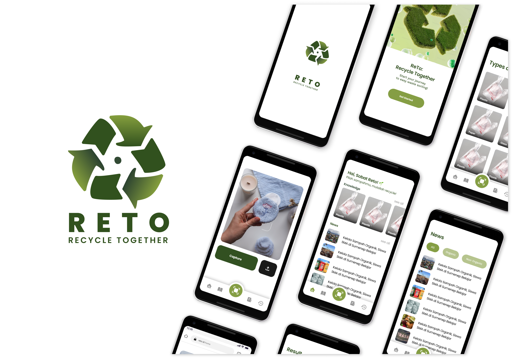

# Reto: Recycle Together 🌍♻️  
*A smart solution for waste management and environmental awareness.*

---

---
## 🎯 About Reto  
**Reto: Recycle Together** is a mobile application designed to revolutionize waste management by simplifying the process of waste sorting and promoting environmental awareness. Built for communities and individuals, Reto leverages AI-powered image recognition and interactive educational features to inspire responsible waste disposal habits.

---

## 🚀 Key Features  
1. **AI-Powered Waste Detection**  
   - Use your phone’s camera to identify waste types (organic, inorganic, hazardous).  
   - Get immediate guidance on proper disposal or recycling.  

2. **Environmental News & Education**  
   - Stay updated with the latest environmental news.  
   - Access practical tips to live a more eco-friendly life.  

3. **Gamification & Rewards**  
   - Earn points for sorting waste correctly and redeem them for discounts or rewards.  
   - Track your contributions to a cleaner environment.  

---

## 🛠️ Tech Stack  
- **Frontend:** Kotlin (Android)  
- **Backend:** Firebase & Cloud Infrastructure  
- **Machine Learning:** TensorFlow Lite (Image Recognition Model)  
- **APIs:** Custom REST APIs for data and model integration  

---

## 🎯 Why Choose Reto?  
- **Simple and Effective:** No more confusion about waste sorting. Reto makes it quick and effortless.  
- **Future-Ready:** Built with scalability in mind, Reto can adapt to new features and larger user bases.  

---
## 👥 Team Members

| Name                         | Learning Path       | GitHub                                     |
| ---------------------------- | ------------------- | ------------------------------------------ |
| David Samuel Sitorus         | Machine Learning    |  |
| I Putu Edgar Kusuma Bagus Taradipa | Cloud Computing    |  |
| I Putu Rangga Sutha Santana  | Cloud Computing     |  |
| Ni Kadek Ari Diah Lestari    | Mobile Development  |  |
| Ni Komang Vaniya Apriandani  | Machine Learning    |  |
| Sinta Purnama Dewi           | Machine Learning    |  |
| Sultan Azizul Haromain       | Mobile Development  |  |

---
## 🔧 Repository
- **[Cloud Computing](https://github.com/puturangga21/capstone-reto-cc)**  
  Repository for backend infrastructure, API management, and cloud deployment of Reto.

- **[Mobile Development](https://github.com/sultanazizul/capstone-reto-md)**  
  Repository for the Android front-end, UI/UX design, and integration with machine learning models.

- **[Machine Learning](https://github.com/kecoaxx/capstone-reto-ml)**  
  Repository for AI-powered waste detection models using TensorFlow Lite.

